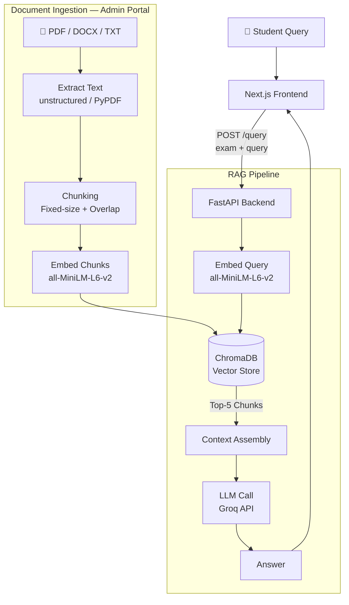
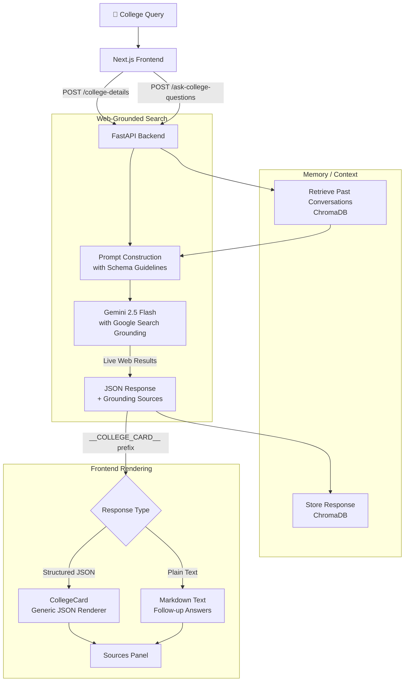

# PrepMate — System Architecture

## RAG Pipeline (Know Your Exam)

---

## Web Search Pipeline (Explore College)

---

## Tech Stack Summary

| Layer | RAG | Web Search |
|---|---|---|
| **LLM** | Groq (Llama / Mixtral) | Gemini 2.5 Flash |
| **Embedding** | all-MiniLM-L6-v2 | — |
| **Vector DB** | ChromaDB | ChromaDB (memory) |
| **Retrieval** | Top-5 semantic chunks | Google Search Grounding |
| **API** | FastAPI `/query` | FastAPI `/college-details` `/ask-college-questions` |
| **Frontend** | Chat Interface | CollegeCard + Sources |
